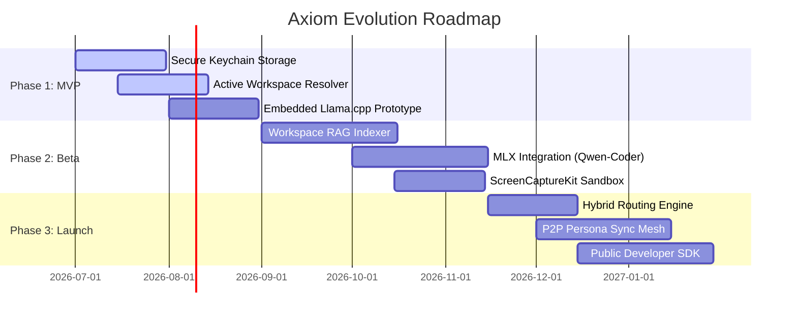

# Strategic Evolution Plan: Axiom & AxiomOS Platform

This document presents a comprehensive strategic analysis and architectural roadmap for the evolution of the Axiom platform and AxiomOS desktop companion. It outlines high-impact, state-of-the-art (SOTA) features and system-level enhancements designed to maximize developer utility, minimize workflow friction, and secure a premium market position.

---

## 1. Current State Assessment

### Core Value Proposition
The **Axiom Suite** bridges the semantic gap in human-AI interaction by translating conversational inputs into optimized prompt engineering directives. It operates across two environments:
1. **Axiom Chrome Extension (MV3)**: Integrates directly into cloud LLMs (Claude, ChatGPT, Gemini, DeepSeek). It uses a hybrid router to execute optimizations locally via Chrome's native `window.ai` (Gemini Nano) or falls back to cloud Gemini APIs, protecting settings with client-side AES-GCM 256-bit cryptography.
2. **AxiomOS macOS Companion**: An ultra-lightweight, 100% native Swift menu bar accessory (~30MB idle RAM, 0.0% CPU) that intercepts highlighted text system-wide via Carbon hotkeys (`Ctrl+Shift+Space`), overlays a glassmorphic HUD, and writes optimized text in-place using accessibility APIs (`AXUIElement`) or virtual keyboard fallbacks.

### Primary Friction Points & Technical Limitations
While AxiomOS provides low-latency, zero-bloat text optimization, it faces several limitations:
* **Stateless Workspace Context**: Optimizations are limited to the highlighted text. The AI cannot access adjacent codebase files, folder structure, active git diffs, or compiler errors, forcing the user to copy-paste context manually.
* **Fragile Accessibility Injection**: Sandboxed or secure applications (e.g., terminal emulators, Slack, enterprise IDEs) frequently block accessibility writes. The keyboard fallback (`Cmd+C` / `Cmd+V`) works but occasionally conflicts with local clipboard history or active typing focus.
* **Cloud Dependency on Desktop**: Unlike the Chrome extension, the macOS desktop utility requires an active internet connection and transmits text to cloud APIs. This prevents offline use and violates data sovereignty policies in secure enterprise environments.
* **Lack of Multimodal/Visual Context**: Developers and UI designers frequently prompt based on visual assets (e.g., misaligned CSS, Figma designs, layout bugs). A text-only input limits the tool's effectiveness for frontend development.

---

## 2. Strategic Innovation Pillars

To resolve these friction points, the platform will expand through three SOTA architectural shifts:

### Pillar 1: Ambient Context Stitching & Workspace RAG
* **Conceptual Overview**: Elevates AxiomOS from a simple text replacement tool to an intelligent, workspace-aware assistant. When text is highlighted, the utility automatically gathers relevant local developer context (surrounding files, project dependencies, recent git diffs, active terminal compiler errors) and attaches it as structured background metadata to the optimization prompt.
* **Technical Implementation**:
  * Implement active application inspectors using macOS Apple Events and accessibility hierarchies to resolve the target workspace folder in VS Code, Xcode, or Terminal.
  * Execute a lightweight, non-blocking workspace scanner in Swift that indexes files and constructs a local semantic model using an on-device vector database (e.g., SQLite with a vector extension or native Swift-based indexing).
  * Build local embedding vectors on the **Apple Neural Engine (ANE)** via CoreML to query related files.
  * Append a metadata envelope to the API payload containing: active programming language, surrounding function signatures, recent git changes, and build errors.
* **User Impact**: A developer highlights a comment like `// TODO: Refactor using the new key helper` and presses `Ctrl+Shift+O`. AxiomOS automatically scans the directory, reads the implementation of `KeychainHelper.swift`, compiles the correct syntax, and writes the complete, refactored code block in-place, eliminating manual context assembly.

### Pillar 2: Local Apple Silicon Inference (MLX & Apple Neural Engine)
* **Conceptual Overview**: Enables complete offline operation and absolute data privacy by running prompt optimizations locally. By integrating Apple's high-performance **MLX** machine learning framework and utilizing the Apple Neural Engine (ANE) and Metal GPU, AxiomOS can run quantized code-specialized models directly in unified system memory with zero cloud billing and zero network latencies.
* **Technical Implementation**:
  * Integrate an embedded inference engine into `GeminiClient.swift` that runs local GGUF or MLX-format weights (e.g., `Qwen-2.5-Coder-3B/7B` or `Llama-3.2-3B`).
  * Utilize macOS Sequoia's local translation and machine learning APIs, or write native Swift bindings for model execution.
  * Implement a **Dynamic Hybrid Router** on the desktop:
    1. *Local Path*: Simple grammar corrections, summaries, and code optimization tasks execute locally on-device under 150ms.
    2. *Cloud Path*: Complex, multi-file refactoring tasks that exceed local context constraints fall back to cloud Gemini models (e.g., Gemini 1.5 Pro).
* **User Impact**: Enterprise developers in highly secure sectors (e.g., defense, banking, healthcare) can optimize proprietary source code system-wide without sending data to external servers. It also guarantees seamless, zero-latency optimization during flights or internet outages.

### Pillar 3: Multi-Modal Window-Aware Capture (Spatial Context)
* **Conceptual Overview**: Introduces visual and spatial awareness into the optimization loop. By capturing the visual layout of the active window, AxiomOS enables screen-to-code synthesis and visual bug detection. It bridges the gap between text editors and visual design outputs.
* **Technical Implementation**:
  * Leverage the high-performance macOS **ScreenCaptureKit** API to take frame-level captures of the active application window directly under the mouse cursor.
  * Apply local optical character recognition (OCR) and layout analysis using the macOS Vision framework.
  * Stream the visual frame alongside the text selection to a multimodal model (on-device or via cloud Gemini 1.5 Flash/Pro) to allow spatial reasoning.
* **User Impact**: A frontend developer highlights a CSS class, points the cursor at a misaligned component in the web browser, and presses `Ctrl+Shift+Space`. The AI analyzes both the code and the visual misalignment, identifies the layout bug, and writes the corrected CSS properties directly back to the code editor.

---

## 3. Comparative Framework

The table below evaluates the proposed features against current industry benchmarks:

| Feature | Ease of Adoption (1-10) | Potential Market Impact | Technical Complexity | Long-term Scalability | Industry Benchmark Comparison |
| :--- | :---: | :---: | :---: | :---: | :--- |
| **Ambient Context Stitching** | 9 / 10 | **High** | Medium | **High** | Outperforms standard IDE-locked assistants (e.g., Copilot) by bringing workspace-aware context system-wide to any application (Slack, Terminal, Xcode). |
| **Local Apple Silicon Inference** | 8 / 10 | **High** | High | **High** | Replaces cloud-only utilities (like standard OpenAI wrapper apps) with local offline execution, offering zero token costs and zero telemetry. |
| **Multi-Modal Window Capture** | 7 / 10 | **Medium** | High | **Medium** | Replaces manual screen-cropping and prompt pasting with instant, window-isolated visual context for frontend design adjustments. |

---

## 4. Methodology and Logical Assumptions

### Core Strategic Assumptions
1. **OS-Level Intelligence Consolidation**: Operating systems are transitioning from passive launchers to proactive intelligence layers (e.g., Apple Intelligence, Windows Copilot). Simple, stateless text wrappers will quickly become obsolete as native features mature.
2. **Apple Silicon Dominance in Dev Workflows**: The unified memory architecture of M-series Macs enables exceptionally fast local LLM inference. Quantized 3B to 8B models can run at 30+ tokens per second on consumer-grade hardware, making on-device AI a practical option.
3. **Privacy Sovereignty**: Enterprises are increasingly banning cloud AI code completion tools due to data leakage concerns. On-device processing is a key prerequisite for unlocking corporate adoption.

### Prioritization Logic
* **Pillar 1 (Ambient Context)** is prioritized first because it addresses the most common developer pain point (lack of workspace context) and uses existing cloud APIs, providing the fastest route to high-value features.
* **Pillar 2 (Local Inference)** is prioritized second to establish offline capabilities and provide enterprise-grade privacy.
* **Pillar 3 (Multimodal)** is prioritized third due to the higher complexity of multi-modal models, serving as a powerful differentiator for frontend developers and designers.

---

## 5. Implementation Roadmap

### Phase 1: MVP / Proof of Concept
* **Milestone 1**: Complete migration of desktop configuration from plain text `~/.axiom_config.json` to the secure macOS Keychain, protecting developer credentials via hardware-level enclaves.
* **Milestone 2**: Implement basic workspace path detection in Swift to locate adjacent project folders.
* **Milestone 3**: Build a lightweight Swift proof-of-concept runner linking `llama.cpp` to execute a small 1.5B parameter model locally on-device.

### Phase 2: Beta Integration & Feedback Loops
* **Milestone 1**: Build the background semantic indexer, extracting git diffs, file trees, and compiler logs to pass as context.
* **Milestone 2**: Implement native Apple MLX-swift compilation inside the build target, optimizing model execution for Apple Silicon.
* **Milestone 3**: Develop the ScreenCaptureKit window frame capture pipeline behind a developer feature flag.
* **Milestone 4**: Open beta program for developer dogfooding to gather performance metrics and refine focus restoration timings.

### Phase 3: Full-Scale Deployment & Ecosystem Expansion
* **Milestone 1**: Ship the Dynamic Hybrid Router, automatically switching between local and cloud execution based on prompt complexity and system load.
* **Milestone 2**: Launch the decentralized peer-to-peer (P2P) sync mesh using Bonjour/mDNS, enabling zero-knowledge synchronization of personas and history across personal devices.
* **Milestone 3**: Publish an open API/SDK allowing developers to build custom context adapters (e.g., database connection adaptors, Jira ticket integrators) for AxiomOS.

---

## 6. Qualitative Synthesis

The proposed enhancements transform AxiomOS from a **tactical text-manipulation utility** into an **essential ambient developer companion**. 

By stitching together local workspace context, local Apple Silicon acceleration, and multimodal visual capture, AxiomOS eliminates the cognitive load of prompt engineering. The developer no longer acts as a manual copy-paste bridge between the editor, terminal, browser, and the LLM. Instead, the assistant operates as an extension of the operating system itself—fully aware of what the developer sees, what code they are writing, and the architecture of the project.

This transition secures Axiom's longevity against OS-level default features by offering a developer-first tool optimized for speed, precision, and privacy.
