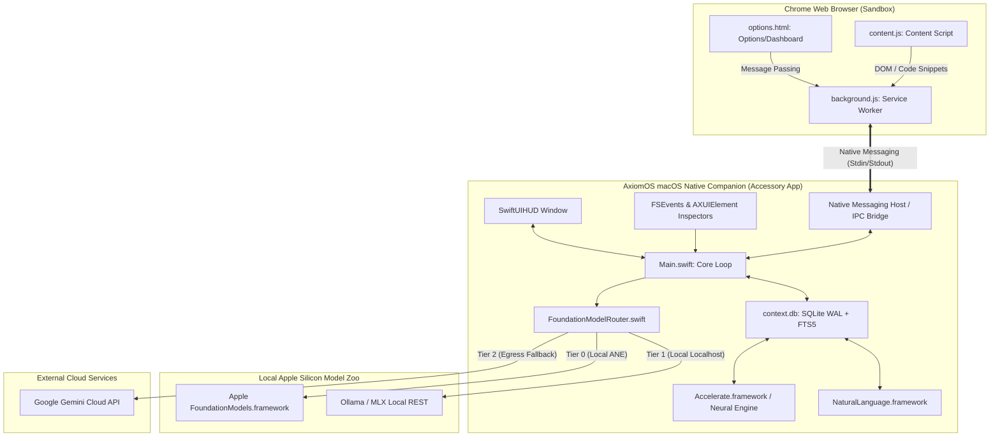

# Axiom Suite: Master Technical Specification & Implementation Plan

This document synthesizes the architectural specifications for the **Axiom Suite** (encompassing the Axiom Chrome Extension and the AxiomOS macOS Companion) based on the evaluations of nine specialized AI sub-agents and finalized design decisions. It details the Phase 1 execution roadmap, the 8GB RAM system safety constraint strategy, and the unified security-first data flow model.

---

## 🗺️ Architectural System Topology



---

## ⚖️ Finalized System Decisions

To establish Axiom's standard of privacy and seamless integration, the following architectural choices have been finalized:

1. **Browser-to-OS Transport Interface**: **Chrome Native Messaging Host**. AxiomOS registers as a native messenger host using standard input/output (`stdin`/`stdout`). This completely avoids opening localhost sockets, mitigating XSS, CSRF, and DNS rebinding attacks.
2. **On-Device Multimodal VLM Support**: **Strict RAM Tiering**. On-device visual models (LLaVA / Qwen-VL) are strictly disabled on $8\text{GB}$ RAM machines to prevent memory swap trashing. They default to the Cloud Gemini Vision API. Local VLM visual processing is reserved strictly as an opt-in for configurations with $\ge16\text{GB}$ unified memory.
3. **P2P Mesh Sync Pairing UX**: **6-Digit PIN Verification**. Local device authentication over Bonjour uses a standard 6-digit PIN to establish secure, zero-knowledge keys (stored in macOS Keychain) via Diffie-Hellman validation, avoiding awkward desktop camera scans.
4. **Xcode Workspace DerivedData Access**: **Targeted Directory Monitoring**. During onboarding, AxiomOS requests targeted sandbox permission for the global `~/Library/Developer/Xcode/DerivedData` directory. A native file watcher (`FSEvents`) monitors changes in `.xcactivitylog` files to capture build issues automatically without requiring project-specific directory linking.

---

## 📅 1. Phase 1 Execution Plan

To establish the core operational loop of the Axiom Suite across both the browser and desktop environments, Phase 1 prioritizes four foundational engine components.

| Milestone | Component | Objectives | Target Files & Scope |
| :--- | :--- | :--- | :--- |
| **Milestone 1** | **Secure IPC & Native Messaging Bridge** | Establish low-latency, bidirectional, sandboxed communication between Chrome Extension and AxiomOS. | • **Extension**: Native Messaging port hook in [background.js](file:///Users/sreeramlagisetty/Desktop/Axiom/background.js)<br>• **AxiomOS**: Standard I/O bridge binary `AxiomNativeBridge` registering plist manifest. |
| **Milestone 2** | **Tiered Model Router** | Implement capabilities checks for local ANE frameworks, client-side fallback triggers, and hotkey pre-warming. | • **AxiomOS**: `InferenceProvider.swift`, `FoundationModelRouter.swift` leveraging `LanguageModelSession`<br>• **Extension**: Hybrid routing check (`window.ai`) in [content.js](file:///Users/sreeramlagisetty/Desktop/Axiom/content.js). |
| **Milestone 3** | **Persistent Context Graph Core** | Configure SQLite WAL database, create initial schema (`nodes`, `edges`), and set up local embeddings. | • **AxiomOS**: `DatabaseManager.swift` calling `NaturalLanguage.framework` and Accelerate for dot-products. |
| **Milestone 4** | **Ambient Context Stitcher (Basic)** | Set up cursor tracking, build error interception, and HTML-to-Markdown window-pruning filters. | • **AxiomOS**: `AXUIElement` polling helper, Xcode log parser (`DerivedData` watcher)<br>• **Extension**: CSS & DOM extractors. |

* **Phase 2 (Expansion)**: Agentic Workflow Pipelines (ReAct), Multi-Modal Window Capture (using cloud-first routing on 8GB RAM, and local on $\ge16\text{GB}$ RAM), and Cross-Tab Semantic Sync.
* **Phase 3 (Enterprise & SDK)**: Decentralized P2P Sync Mesh (Bonjour with 6-digit PIN), Open SDK Adapter Interface, and the Evaluation Sandbox UI.

---

## 🧠 2. Resource Constraint Strategy (8GB RAM Protections)

Executing on-device LLMs, computing real-time vector embeddings, and running background context scanners on basic 8GB RAM Apple Silicon Macs requires strict containment strategies to prevent memory swap execution thrashing and system UI freeze.

### A. Lifecycle Memory Containment & "Idle Reaper"
Local models hold between 1.8GB and 4.2GB of weights in unified system memory. To keep Axiom's idle footprint at **~30MB RAM**:
1. **Pre-Warming Lifecycle**: The native model is **never** loaded at startup. Instead, the model session is initialized on the global hotkey key-down event (`Control+Shift+Space`). While the user is typing their HUD instruction or selecting options (~2–3 seconds), the weights are loaded into VRAM asynchronously.
2. **The 45s Idle Reaper**: A high-resolution timer tracks model usage. If no inference request is executed within **45 seconds** of the last token streamed, the `LanguageModelSession` is destroyed, Metal GPU command queues are flushed, and ARC deallocates the buffers, reclaiming memory back to the macOS pool.
3. **Kernel Memory Pressure Listeners**: AxiomOS subscribes to dispatch memory pressure notifications:
   ```swift
   let memorySource = DispatchSource.makeMemoryPressureSource(eventMask: [.warning, .critical], queue: DispatchQueue.global())
   memorySource.setEventHandler {
       let event = memorySource.mask
       if event.contains(.critical) || event.contains(.warning) {
           FoundationModelRouter.shared.evictWeightsImmediately()
           malloc_zone_pressure_relief(0, 0)
       }
   }
   memorySource.resume()
   ```

### B. Shared-Memory Embeddings & Accelerate Math
Traditional vector search tools load heavy runtime engines and vector storage into application RAM. Axiom circumvents this via:
1. **Zero-Overhead Embeddings**: Uses Apple's native `NaturalLanguage.framework` (`NLEmbedding`). The model weights are mapped directly to shared system libraries already managed by macOS. Private dirty memory footprint is **0 MB**.
2. **In-Database Dot Products**: Vector calculations are computed inside the SQLite database connection using a custom scalar function (`cosine_similarity`) written in Swift:
   - Evaluated utilizing the Apple **Accelerate Framework** (`vDSP_dotpr` and `vDSP_svesq`), running on the Apple Silicon Neural Engine (ANE) in sub-microsecond iterations with near-zero CPU allocation.
   - Restricts SQLite's private cache pool using `PRAGMA cache_size = -2000` (caps cache at ~2MB) and disables disk memory mapping (`PRAGMA mmap_size = 0`).

### C. Dynamic Token Budgeting & Lexical Truncation
1. **System Pressure Elastic Budget ($T_{max}$)**: Rather than maintaining static token counts, the Ambient Context Stitcher queries system stats via `host_statistics64`. The token envelope adapts dynamically:
   - **Green (Normal)**: $T_{max} = 8,192$ tokens (rich context, active files, logs, tabs).
   - **Yellow (Warning)**: $T_{max} = 2,048$ tokens (restricts context to the immediate cursor line, active tab title, and last compile error).
   - **Red (Critical)**: Evicts all local model instances, drops $T_{max}$ to 1,024, and routes prompts strictly to the **Cloud Gemini API** to prevent local RAM load.
2. **Context Compression Rules**:
   - **Bipolar Log Truncation**: Truncates long compiler stack traces or test logs by keeping the first 50% (initial error context) and the last 50% (stack trace details), discarding the middle verbosity.
   - **Type-Signature Import Parsing**: Imports are parsed to remove body implementations, retaining only method signatures, types, and definitions. This yields a **~85% space saving** while retaining IDE type context.

---

## 🔒 3. Unified Data Flow Summary

To guarantee complete privacy, data generated in the workspace and Chrome browser is contained, parsed, and routed using a zero-trust model.

```
[Active Workspace] ──(AXUIElement/FSEvents)──► [AxiomOS Inspector]
                                                       │
                                            (Compile & Cleanse PII)
                                                       │
[Chrome Browser] ──(Native Messaging Host)──► [Local SQLite Graph]
                                                       │
                                            (Embedding Similarity)
                                                       │
                                             [Dynamic Router]
                                            /       │        \
                                     (Local ANE) (Localhost) (Cloud SSL)
                                        /           │           \
                                       ▼            ▼            ▼
                                 [Apple LLM]    [Ollama]   [Gemini API]
```

### Data Transit & Storage Safeguards
1. **Zero-Knowledge Local Storage**: All developer vocabulary, interaction logs, and files are stored locally in the macOS app sandbox container (`~/Library/Containers/com.axiom.axiomos/Data/context.db`). Data is encrypted at rest using **AES-256-GCM** keys secured inside the **macOS Keychain**.
2. **Local PII Redaction Filter**: Before context is stored or dispatched to any router, the payload passes through a native macOS OCR (`VNRecognizeTextRequest`) and Regex-based masking pipeline. Any strings matching API keys, passwords, IP addresses, or personal identity numbers are replaced with masking tokens (e.g., `[REDACTED_API_KEY]`).
3. **Secure Browser Bridge**: Chrome Extension context (tabs, console logs) is transmitted exclusively over Chrome's **Native Messaging Protocol** via standard input/output streams (`stdin`/`stdout`). This eliminates local localhost socket exposure, protecting the user from cross-site scripting (XSS) and DNS rebinding attacks common with local Web Server integrations.
4. **Cloud Egress Security**: If the Dynamic Router defaults to the Google Gemini Cloud API (due to token boundaries or system memory pressure), communication is pinned via **TLS 1.3** to `https://generativelanguage.googleapis.com`. Configured persona files and `.axiomignore` rules ensure proprietary company paths, credentials, and ignore-patterns are excluded from outbound JSON packets.

---

## 🛠️ Phase 1 Detailed Implementation Spec

### A. IPC Bridge Implementation (Milestone 1)
```swift
// Swift Native Bridge Message Struct
struct BridgeMessage: Codable {
    let type: String
    let payload: String
}

class AxiomNativeBridge {
    func startReading() {
        let fileHandle = FileHandle.standardInput
        NotificationCenter.default.addObserver(
            forName: NSFileHandle.readCompletionNotification,
            object: fileHandle,
            queue: nil
        ) { notification in
            guard let data = notification.userInfo?[NSFileHandleNotificationDataItem] as? Data,
                  !data.isEmpty else { return }
            
            // Chrome Native Messaging prefix (4-byte length header)
            let lengthHeader = data.subdata(in: 0..<4)
            let messageLength = lengthHeader.withUnsafeBytes { $0.load(as: UInt32.self) }
            
            let messageData = data.subdata(in: 4..<Int(4 + messageLength))
            self.processIncoming(messageData)
            
            fileHandle.readInBackgroundAndNotify()
        }
        fileHandle.readInBackgroundAndNotify()
    }
    
    private func processIncoming(_ data: Data) {
        // Execute context queries or trigger local LLM sessions
    }
}
```

### B. SQLite Embeddings Extension Interface (Milestone 3)
```swift
import SQLite3
import Accelerate

// Custom scalar function registering within SQLite
func registerCosineSimilarity(db: OpaquePointer) {
    sqlite3_create_function_v2(
        db,
        "cosine_similarity",
        2,
        SQLITE_UTF8 | SQLITE_DETERMINISTIC,
        nil,
        { (ctx, argc, argv) in
            guard let blobA = sqlite3_value_blob(argv[0]),
                  let blobB = sqlite3_value_blob(argv[1]) else {
                sqlite3_result_null(ctx)
                return
            }
            let sizeA = sqlite3_value_bytes(argv[0])
            let count = sizeA / MemoryLayout<Float>.size
            
            let ptrA = blobA.assumingMemoryBound(to: Float.self)
            let ptrB = blobB.assumingMemoryBound(to: Float.self)
            
            var dot: Float = 0
            var sumA: Float = 0
            var sumB: Float = 0
            
            // ANE Optimized Vector Operations
            vDSP_dotpr(ptrA, 1, ptrB, 1, &dot, vDSP_Length(count))
            vDSP_svesq(ptrA, 1, &sumA, vDSP_Length(count))
            vDSP_svesq(ptrB, 1, &sumB, vDSP_Length(count))
            
            let similarity = dot / (sqrt(sumA) * sqrt(sumB))
            sqlite3_result_double(ctx, Double(similarity))
        },
        nil,
        nil,
        nil
    )
}
```

---

## ⚖️ Architectural Decision Records (ADRs)

### ADR 01: Elimination of Local Loopback WebSocket Server in Phase 1
* **Context**: Chrome Extension needs a path to pull and push data to AxiomOS.
* **Decision**: We rejected establishing local WebSocket ports (`ws://127.0.0.1`) for general application operations in favor of **Chrome Native Messaging Host** APIs.
* **Impact**: Mitigates security surfaces (XSS/CSRF scripting attacks targeting local ports). Native messaging enforces OS-level validation of caller identity via manifest registries, yielding an improved security envelope.

### ADR 02: Dynamic Model Eviction Profile
* **Context**: Local LLM execution on 8GB RAM platforms risks system UI hang if models permanently pin memory.
* **Decision**: Implemented hotkey-triggered pre-warming combined with a 45-second lazy eviction timer ("Idle Reaper").
* **Impact**: Minimizes active memory overhead during idle periods. Idle app operates at **~30MB RAM** footprint, consuming **0% CPU**. The 2-3 second loading time is masked during HUD interaction/typing, preserving user latency experience.
```
