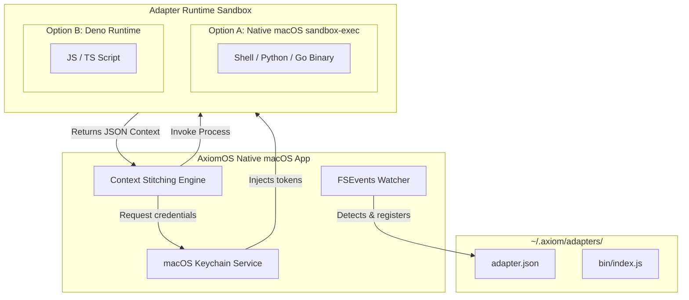
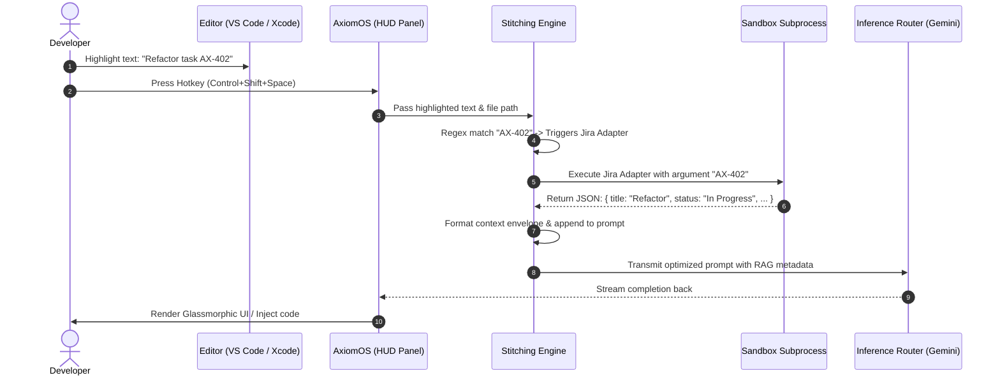
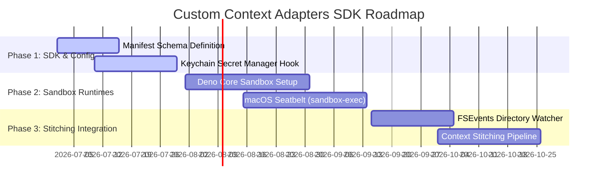

# Custom Context Adapters (Open SDK) Architecture
### *A Technical Specification for Secure Enterprise Context Integration in Axiom & AxiomOS*

---

> [!IMPORTANT]
> This specification outlines the architecture, SDK interface, sandboxed runtime, and context stitching mechanisms for the **Axiom Custom Context Adapter SDK**. It adheres to AxiomOS's constraints of maintaining a **native macOS footprint** (~30MB idle RAM, 0.0% idle CPU) while providing robust enterprise-grade **zero-knowledge security sandboxing**.

---

## 1. Executive Summary & Goals

Enterprise developers frequently require their AI assistant to be aware of proprietary metadata—such as active Jira issues, internal API documentations, Confluence wikis, or schema layouts of local development databases. However, copying and pasting this information manually is a source of high cognitive friction and poses significant data-leakage risks.

The **Custom Context Adapters SDK** provides a secure, lightweight, and extensible plugin framework enabling developers to connect Axiom and AxiomOS to internal systems.

### Core Architectural Goals:
1. **Low Footprint Integration**: Zero background CPU polling, utilizing native macOS filesystem event streams (`FSEvents`) for registration.
2. **Polyglot Execution**: Allowing developers to write adapters in JavaScript/TypeScript, Python, Go, Rust, or simple shell scripts.
3. **Rigid Security Sandboxing**: Restricting filesystem read/writes and network egress to pre-declared scopes via macOS `sandbox-exec` and Deno core runtimes.
4. **Zero-Knowledge Architecture**: Credentials (tokens, connection strings) must be stored in the macOS Keychain, never exposed to third-party endpoints or logged in plaintext.
5. **Deterministic Stitching**: Standardizing adapter inputs and outputs so Axiom's context engine can compile, compress, and feed relevant metadata directly into the model's prompt context.

---

## 2. Adapter Lifecycle & Manifest Schema

Every adapter is packaged as a directory containing a manifest configuration file (`adapter.json`) and the executable code. These directories are located in the local configuration path: `~/.axiom/adapters/`.

### 2.1 The Adapter Manifest (`adapter.json`)
The manifest declares how the adapter registers with the context engine, what inputs it accepts, and its sandbox permissions.

```json
{
  "$schema": "https://axiom.run/schemas/adapter.v1.json",
  "id": "com.axiom.adapter.jira",
  "name": "Jira Ticket Resolver",
  "version": "1.0.0",
  "description": "Fetches ticket description, assignee, and comments for highlighted Jira ticket IDs.",
  "entrypoint": "bin/index.js",
  "runtime": "deno",
  "triggers": {
    "regex": "\\b[A-Z]{2,10}-[0-9]+\\b",
    "fileExtensions": [".swift", ".js", ".ts", ".py", ".rs"],
    "slashCommands": ["/jira"]
  },
  "inputs": [
    {
      "name": "ticketId",
      "type": "string",
      "description": "The matched Jira ticket ID (e.g. AX-204)",
      "required": true
    }
  ],
  "sandbox": {
    "permissions": {
      "network": {
        "allow": ["api.jira.com", "mycompany.atlassian.net"]
      },
      "filesystem": {
        "read": ["$WORKSPACE_ROOT"],
        "write": []
      },
      "keychain": {
        "requiredKeys": ["JIRA_API_TOKEN", "JIRA_USER_EMAIL"]
      }
    },
    "timeoutMs": 1500
  }
}
```

---

## 3. Runtime Execution Model

AxiomOS must support a variety of adapter languages while protecting the host system from slow or unsafe execution.



### 3.1 Evaluating Runtime Models
We evaluate three execution models for running these plugins:

| Evaluation Dimension | Option A: Native Executable Subprocess (`sandbox-exec`) | Option B: Embedded Deno Runtime | Option C: Local HTTP Webhooks |
| :--- | :--- | :--- | :--- |
| **Supported Languages** | Any compiled binary or script (Shell, Python, Go, Rust) | JavaScript, TypeScript, WebAssembly | Any (language-agnostic web server) |
| **Security Sandbox** | High (kernel-level MAC sandbox profile enforcement) | Very High (granular V8 isolates and Deno network/disk flags) | Medium (relies on self-signed local TLS & endpoint isolation) |
| **Runtime Footprint** | Low (spawns short-lived process, terminates instantly) | Medium (~25MB RAM per execution, fast startup) | High (requires background server daemon running continuously) |
| **Developer Ergonomics** | Simple (no boilerplate, executes anything) | Extremely Simple (no build step, runs plain JS/TS) | Complex (requires server deployment, port management, routing) |
| **Recommended Choice** | **Primary (for CLI/Python/Compiled adapters)** | **Primary (for JS/TS lightweight scripting)** | **Alternative (for remote intranet gateways)** |

### 3.2 Recommended Hybrid Runtime Model
To combine security, performance, and developer utility, AxiomOS adopts a **dual-engine execution architecture**:

1. **The Deno Sandboxed Engine (Standard JS/TS)**:
   For scripts declaring `"runtime": "deno"`. AxiomOS embeds a slim, pre-compiled Deno executable inside its app bundle. Deno executes user scripts in V8 isolates, using strict execution arguments mapping directly to the manifest:
   ```bash
   deno run \
     --allow-net=mycompany.atlassian.net \
     --allow-read=/Users/developer/workspace \
     --no-prompt \
     index.js
   ```
2. **The `sandbox-exec` Subprocess Engine (Polyglot Executables)**:
   For scripts declaring `"runtime": "native"`. AxiomOS spawns a subprocess wrapping the command in macOS's native Seatbelt sandbox (`/usr/bin/sandbox-exec`). The sandbox profile restricts filesystem modifications and blocks all network sockets except those declared in `adapter.json`.

---

## 4. Security Sandboxing Architecture

To comply with enterprise security constraints, Custom Context Adapters run in a strict **zero-trust execution environment**.

### 4.1 Sandboxing Profiles (macOS Seatbelt)
For non-JS native scripts or binaries, AxiomOS dynamically generates a temporary Seatbelt profile (`.sb` file) at invocation. This profile is enforced at the kernel level by macOS:

```scheme
;; seatbelt_profile.sb
(version 1)
(deny default)

;; Allow reading execution binary and runtime libraries
(allow file-read*
       (literal "/usr/bin/python3")
       (subpath "/System/Library")
       (subpath "/usr/lib")
       (subpath "/Users/developer/.axiom/adapters"))

;; Restrict write access entirely to a dedicated temporary folder
(allow file-write*
       (subpath "/private/tmp/axiom-sandbox"))

;; Restrict filesystem reading to the active project workspace root only
(allow file-read*
       (subpath "/Users/developer/Desktop/Axiom"))

;; Restrict network communication only to explicit domains
(allow network-outbound
       (remote ip "api.jira.com:443")
       (remote ip "mycompany.atlassian.net:443"))
```

AxiomOS spawns the subprocess using this generated profile:
```bash
sandbox-exec -f seatbelt_profile.sb /usr/bin/python3 adapter.py
```

### 4.2 Secure Keychain Ingestion
Adapters must never store API tokens, database passwords, or credentials on the filesystem in plain text.
* During installation, AxiomOS scans `adapter.json` for `requiredKeys`.
* AxiomOS prompts the user through a native UI panel to input these credentials once.
* These keys are saved directly into the **macOS Keychain** under the service tag `com.axiom.adapter.[adapter-id]`.
* At run-time, AxiomOS retrieves the tokens and injects them securely into the sandboxed process's environment variables (e.g., `process.env.JIRA_API_TOKEN`). They are never written to disk.

### 4.3 Outbound Network Controls & Timeout Guardrails
* **No Local Network Sniffing**: Socket creation is restricted to prevent ports from scanning the developer's intranet.
* **Aggressive Timeouts**: To avoid hung processes blocking UI responsiveness, adapters are subject to a hard timeout of **1500ms** (configurable in manifest, maximum cap 3000ms). If an adapter does not return data within the window, the subprocess is sent `SIGKILL` and a graceful placeholder is injected.

---

## 5. Context Stitching Engine Integration

The Context Stitching Engine resolves when an adapter's context should be active and formats the outputs for LLM prompts.



### 5.1 Registration & Directory Watcher
* **Zero Polling Configuration**: AxiomOS uses the native **CoreServices FSEvents API** to monitor changes in `~/.axiom/adapters/`.
* When a developer installs, modifies, or deletes an adapter folder, `FSEvents` triggers a callback in Swift. AxiomOS re-parses the `adapter.json` and updates its active memory routing table.

### 5.2 Context Stitching Flow
When a text selection is intercepted:
1. **Trigger Phase**: The engine checks the highlighted text against the `triggers.regex` of registered adapters, and the active file path against `triggers.fileExtensions`.
2. **Context Resolution Phase**:
   - If a trigger is met, the engine spawns the adapter subprocess.
   - The selected text or active match is passed as arguments: `process.argv` and `stdin`.
   - Environmental variables from the Keychain are attached.
3. **Envelope Formatting Phase**:
   The output of the adapter (standard JSON) is normalized and wrapped in XML-like tags. This format is highly readable for Gemini and local models (Qwen, Llama).

#### Standardized Context Wrapper Output:
```xml
<context_source id="com.axiom.adapter.jira" trigger_match="AX-402">
  {
    "id": "AX-402",
    "summary": "Implement keychain caching layer in Swift",
    "status": "In Progress",
    "assignee": "Sarah Connor",
    "description": "We need to cache credentials locally using KeychainHelper.swift to prevent repeated OS calls.",
    "comments": [
      "Sarah: Make sure we check for duplicate keys",
      "John: Ensure we clear cache on logout"
    ]
  }
</context_source>
```

---

## 6. End-to-End Walkthroughs

### 6.1 Use Case 1: Jira Ticket Resolver Adapter (`bin/index.js`)

This adapter triggers on highlighted ticket patterns (e.g. `PROJ-1234`) and fetches real-time issue descriptions from Jira Cloud.

```javascript
#!/usr/bin/env dts-node
// Runtime: Deno (TypeScript compatible)
// Path: ~/.axiom/adapters/com.axiom.adapter.jira/bin/index.js

const JIRA_DOMAIN = "mycompany.atlassian.net";
const authEmail = Deno.env.get("JIRA_USER_EMAIL");
const authToken = Deno.env.get("JIRA_API_TOKEN");

if (!authEmail || !authToken) {
  console.error(JSON.stringify({ error: "Missing required Keychain credentials." }));
  Deno.exit(1);
}

// Read the input matches sent by AxiomOS via arguments
const matchArgs = Deno.args;
if (matchArgs.length === 0) {
  console.error(JSON.stringify({ error: "No ticket ID provided." }));
  Deno.exit(1);
}

const ticketId = matchArgs[0];

async function fetchJiraTicket(id) {
  const url = `https://${JIRA_DOMAIN}/rest/api/3/issue/${id}?fields=summary,description,status,comment`;
  const headers = new Headers();
  headers.set("Authorization", "Basic " + btoa(`${authEmail}:${authToken}`));
  headers.set("Accept", "application/json");

  const response = await fetch(url, { headers });
  if (!response.ok) {
    throw new Error(`Failed to fetch issue: ${response.statusText}`);
  }
  return await response.json();
}

try {
  const data = await fetchJiraTicket(ticketId);
  const result = {
    id: data.key,
    summary: data.fields.summary,
    status: data.fields.status.name,
    description: data.fields.description?.content?.[0]?.content?.[0]?.text || "No description",
    comments: data.fields.comment?.comments?.slice(-2).map(c => c.body?.content?.[0]?.content?.[0]?.text) || []
  };
  
  // Return context as a single JSON line to standard output
  console.log(JSON.stringify(result, null, 2));
  Deno.exit(0);
} catch (error) {
  console.error(JSON.stringify({ error: error.message }));
  Deno.exit(1);
}
```

---

### 6.2 Use Case 2: Local Database Schema Inspector (`schema_inspector.py`)

This adapter triggers on database keywords (e.g., table names, schema names) or when the user invokes the `/schema` slash command. It connects to a local Postgres instance to pull table definitions.

```python
#!/usr/bin/env python3
# Runtime: Native (executed via sandbox-exec)
# Path: ~/.axiom/adapters/com.axiom.adapter.postgres/schema_inspector.py

import os
import sys
import json
import psycopg2

def fetch_table_schema(db_uri, table_name):
    # Establish read-only connection
    conn = psycopg2.connect(db_uri)
    cursor = conn.cursor()
    
    query = """
        SELECT column_name, data_type, is_nullable
        FROM information_schema.columns
        WHERE table_name = %s;
    """
    cursor.execute(query, (table_name,))
    columns = cursor.fetchall()
    
    cursor.close()
    conn.close()
    
    schema = []
    for col in columns:
        schema.append({
            "column": col[0],
            "type": col[1],
            "nullable": col[2]
        })
    return schema

def main():
    db_uri = os.environ.get("LOCAL_DB_URI")
    if not db_uri:
        print(json.dumps({"error": "LOCAL_DB_URI is not set in Keychain"}), file=sys.stderr)
        sys.exit(1)
        
    if len(sys.argv) < 2:
        print(json.dumps({"error": "No table name provided"}), file=sys.stderr)
        sys.exit(1)
        
    table_name = sys.argv[1]
    
    try:
        schema_data = fetch_table_schema(db_uri, table_name)
        print(json.dumps({
            "table": table_name,
            "schema": schema_data
        }))
        sys.exit(0)
    except Exception as e:
        print(json.dumps({"error": str(e)}), file=sys.stderr)
        sys.exit(1)

if __name__ == "__main__":
    main()
```

---

## 7. Next Steps & Development Roadmap



### Next Milestones:
1. **Formalize JSON Schema**: Commit the `adapter.v1.json` schema to the repository to validate custom manifests.
2. **Develop Swift Subprocess Wrapper**: Build the `AdapterRunner.swift` module inside `AxiomOS` responsible for launching `sandbox-exec` and reading output streams.
3. **Keychain Binding Utilities**: Add UI views in `HUDView.swift` to allow secure variable registration per adapter.
