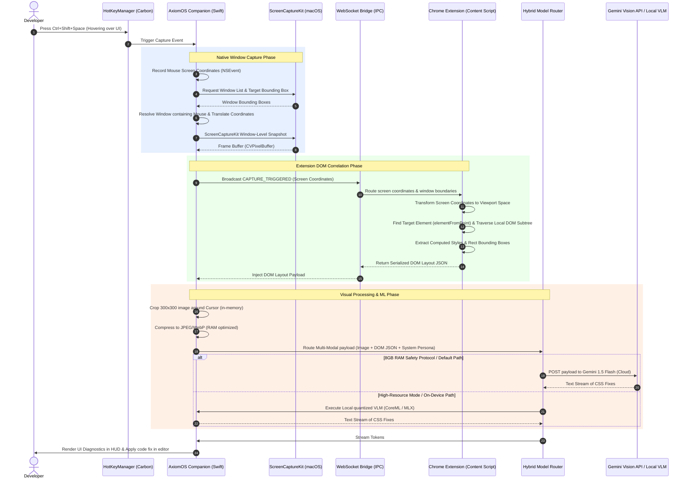
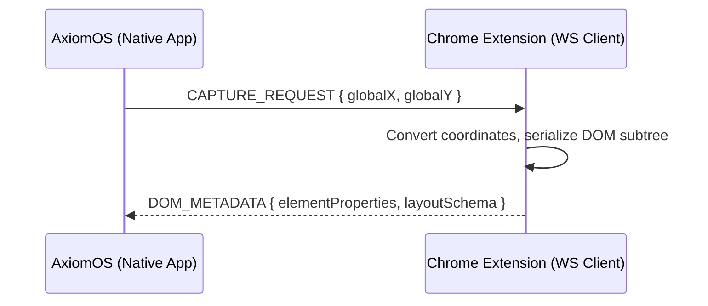

# 👁️ Multi-Modal Window Capture Architecture

This document defines the technical architecture, coordinate translation models, IPC bridging, memory optimizations, and security protocols for the **Multi-Modal Window Capture** feature in AxiomOS.

---

## 📌 Executive Summary

The **Multi-Modal Window Capture** feature provides visual screen-reading capabilities to instantly diagnose UI/CSS misalignments directly from the user's cursor position. 
*   **The Problem:** UI and CSS debugging usually requires opening DevTools, inspect-pointing, manually reviewing styles, and mentally mapping the rendering to the code.
*   **The Solution:** A user points their cursor at a visual bug, presses `Control+Shift+Space` (or a dedicated visual shortcut), and AxiomOS instantly captures a focused visual crop of the misalignment, correlates it with the Chrome Extension's DOM element layout, runs multi-modal analysis, and streams code fixes directly into the developer's stylesheet or target editor.

---

## 🏗️ System Architecture

The following diagram illustrates the end-to-end data flow when the visual debugging hotkey is pressed:



---

## 1. Window Capture & Coordinate Extraction (Native macOS)

### Coordinate Space Translation
macOS uses two conflicting coordinate systems:
1.  **AppKit Coordinate Space (`NSEvent.mouseLocation`)**: Bottom-left origin `(0, 0)`.
2.  **Core Graphics / ScreenCaptureKit Space**: Top-left origin `(0, 0)`.

To accurately target and crop the correct visual portion of a window, coordinates must be mathematically aligned:

$$WL_x = M_x - W_{origin.x}$$

$$WL_y = (W_{origin.y} + W_{height}) - M_y$$

Where:
*   $(M_x, M_y)$ are the mouse coordinates in screen space (origin bottom-left).
*   $(W_{origin.x}, W_{origin.y})$ is the window's screen coordinate origin (bottom-left).
*   $W_{height}$ is the window height.
*   $(WL_x, WL_y)$ are the translated local cursor coordinates relative to the top-left of the captured window.

### Window Targeting via ScreenCaptureKit
Using **ScreenCaptureKit** (macOS 12.3+), we fetch shareable content and filter for the specific window under the mouse cursor.

```swift
import ScreenCaptureKit
import CoreGraphics

class VisualCaptureEngine {
    
    /// Finds the window under the current mouse location and captures a snapshot of it
    func captureActiveWindowUnderCursor() async throws -> CGImage? {
        let mouseLocation = NSEvent.mouseLocation
        
        // 1. Get all shareable content (windows and displays)
        let content = try await SCShareableContent.excludingDesktopWindows(false, onScreenWindowsOnly: true)
        
        // 2. Identify target window enclosing the mouse pointer
        guard let targetWindow = content.windows.first(where: { window in
            // Filter out system overlay panels, menu bars, and Axiom's HUD
            guard window.isOnScreen,
                  let appName = window.owningApplication?.applicationName,
                  appName != "AxiomOS",
                  window.windowID != 0 else { return false }
            
            // Check bounding box containment
            let frame = window.frame
            return mouseLocation.x >= frame.origin.x &&
                   mouseLocation.x <= (frame.origin.x + frame.width) &&
                   mouseLocation.y >= frame.origin.y &&
                   mouseLocation.y <= (frame.origin.y + frame.height)
        }) else {
            print("[Capture] No matching window found under cursor.")
            return nil
        }
        
        // 3. Create content filter matching only the selected window
        let filter = SCContentFilter(desktopFormat: .singleWindow, excluding: [])
        
        // Use custom stream configuration for optimized performance
        let config = SCStreamConfiguration()
        config.showsCursor = false // Exclude cursor rendering to avoid layout obstruction
        config.width = Int(targetWindow.frame.width)
        config.height = Int(targetWindow.frame.height)
        config.pixelFormat = kCVPixelFormatType_32BGRA
        
        // 4. Capture screenshot
        return try await SCScreenshotManager.captureImage(contentFilter: filter, configuration: config)
    }
}
```

### Screen Recording Permission Protocol
Since macOS Catalina (10.15), capturing screen content requires explicit **Screen Recording** permission. AxiomOS checks and requests access as follows:

```swift
class PermissionManager {
    
    /// Check if screen recording permissions are granted programmatically
    static func checkScreenRecordingAccess() -> Bool {
        if #available(macOS 14.0, *) {
            return CGPreflightScreenCaptureAccess()
        } else {
            // Fallback for older macOS versions
            let runningApp = NSRunningApplication.current
            let isTrusted = AXIsProcessTrustedWithOptions([kAXTrustedCheckOptionPrompt.takeUnretainedValue() as String: false] as CFDictionary)
            return CGRequestScreenCaptureAccess()
        }
    }
    
    /// Prompt user to enable permissions in System Settings
    static func requestScreenRecordingAccess() {
        // Triggers the OS system prompt if permission has never been requested
        _ = CGRequestScreenCaptureAccess()
        
        // Provide user-friendly instructions on permission failure
        DispatchQueue.main.async {
            let alert = NSAlert()
            alert.messageText = "Screen Recording Permission Required"
            alert.informativeText = "AxiomOS requires Screen Recording permissions to capture elements under your cursor and diagnose alignment errors. Please enable it under Security & Privacy settings."
            alert.alertStyle = .warning
            alert.addButton(withTitle: "Open System Settings")
            alert.addButton(withTitle: "Later")
            
            if alert.runModal() == .alertFirstButtonReturn {
                if let url = URL(string: "x-apple.systempreferences:com.apple.preference.security?Privacy_ScreenCapture") {
                    NSWorkspace.shared.open(url)
                }
            }
        }
    }
}
```

---

## 2. Dynamic Regional Cropping & Memory Optimization

Sending high-resolution full-window captures to multi-modal APIs violates the **8GB RAM Safety Protocol**, impacts network performance, and compromises user privacy.

### Cropping Pipeline
Instead of full frames, we perform in-memory cropping using Core Graphics centered around the target coordinate:

```swift
extension CGImage {
    /// Crops a square region centered around target point (WL_x, WL_y)
    func cropAroundCursor(x: CGFloat, y: CGFloat, size: CGFloat = 300) -> CGImage? {
        let halfSize = size / 2
        
        // Adjust for Retina scale factor (pixel-to-point backing store conversions)
        let imgWidth = CGFloat(self.width)
        let imgHeight = CGFloat(self.height)
        
        // Define bounding rect in image pixel space
        let cropRect = CGRect(
            x: max(0, min(x - halfSize, imgWidth - size)),
            y: max(0, min(y - halfSize, imgHeight - size)),
            width: size,
            height: size
        )
        
        return self.cropping(to: cropRect)
    }
}
```

### Memory Optimization Rules
1.  **Direct-to-Memory Compression**: Cropped images are converted to compressed JPEG or WebP buffers directly in RAM using `CGImageDestination`. We **never** write raw images to disk to avoid write-cycles and privacy leaks.
2.  **Autorelease Pool Scopes**: Image manipulation allocations are wrapped inside `autoreleasepool { ... }` blocks to force ARC (Automatic Reference Counting) to immediately release intermediate pixel arrays.
3.  **Low Payload Sizes**: 300x300 point crops result in `~600x600` pixel buffers at Retina 2x. High-efficiency JPEG compression at `0.8` quality achieves a final size of **under 40KB** (a 99.9% reduction from the typical 30MB window capture buffer).

---

## 3. Chrome Extension DOM Layout Correlation

To perform exact CSS diagnostics, visual input is correlated with metadata representing the DOM structure at the cursor coordinates.

### Coordinate Handshake
To align global screen mouse positions with web-page viewports, we compute the window-to-viewport offset values inside the browser extension:

```javascript
// Computed styles inside Chrome Extension Content Script
function getViewportScreenCoordinates() {
  const borderWidth = (window.outerWidth - window.innerWidth) / 2;
  const chromeHeight = window.outerHeight - window.innerHeight - borderWidth;

  // Viewport top-left relative to screen origin
  const viewportX = window.screenX + borderWidth;
  const viewportY = window.screenY + chromeHeight;

  return { viewportX, viewportY };
}
```

When AxiomOS broadcasts global coordinates $(Q_x, Q_y)$ to the extension, the coordinates are converted to local browser viewport space:

$$V_x = Q_x - ViewportX$$

$$V_y = Q_y - ViewportY$$

Using these converted coordinates, the content script extracts the matching element:

```javascript
// Resolving elements & serializing context
function extractDOMContextAtScreenCoordinates(globalX, globalY) {
  const { viewportX, viewportY } = getViewportScreenCoordinates();
  const localX = globalX - viewportX;
  const localY = globalY - viewportY;

  // Resolve target element directly under mouse
  const targetElement = document.elementFromPoint(localX, localY);
  if (!targetElement) return null;

  return serializeLayoutSubtree(targetElement);
}

function serializeLayoutSubtree(element, depth = 3) {
  if (!element || depth < 0) return null;

  const rect = element.getBoundingClientRect();
  const computed = window.getComputedStyle(element);

  return {
    tagName: element.tagName.toLowerCase(),
    id: element.id || null,
    className: element.className || null,
    layout: {
      top: rect.top,
      left: rect.left,
      width: rect.width,
      height: rect.height
    },
    styles: {
      display: computed.display,
      position: computed.position,
      margin: computed.margin,
      padding: computed.padding,
      flex: computed.flex,
      grid: computed.grid,
      alignItems: computed.alignItems,
      justifyContent: computed.justifyContent,
      color: computed.color,
      backgroundColor: computed.backgroundColor
    },
    // Recursively capture parent layout for boundary diagnostics
    parent: serializeLayoutSubtree(element.parentElement, depth - 1)
  };
}
```

---

## 4. Native Host <-> Chrome Extension Communication Bridge

To transmit spatial coordinates and DOM layout schemas, AxiomOS coordinates with the Chrome Extension.

### Secure Local WebSocket Connection
AxiomOS hosts a lightweight local WebSocket Server on a high-range random port (e.g., `12948`). 
*   **Security Protocol**: The server strictly validates incoming connection headers. It only permits connections where the `Origin` header matches the unique Chrome Extension protocol `chrome-extension://[YOUR_EXTENSION_ID]`. All other connections are rejected immediately with a `403 Forbidden` status code.
*   **Zero-State Footprint**: The server runs asynchronously inside AppKit's dispatch queues, avoiding CPU cycles when idle.



---

## 5. Multi-Modal Visual Analysis Engine

AxiomOS utilizes a **Hybrid Multi-Modal Router** to deliver visual debugging capabilities without breaching RAM budgets.

### Model Execution Paths
1.  **Cloud Path (Default / 8GB RAM Safe)**: Passes the lightweight base64-encoded JPEG image crop along with the DOM layout JSON block directly to the cloud **Gemini 1.5 Flash** or **Gemini 1.5 Pro** API.
2.  **On-Device Path (High Resource / >=16GB RAM)**: Routes the image crop and text prompt to a local quantized multimodal model (e.g., *LLaVA-1.5-3B-INT4* or *Qwen2-VL-2B-INT4*) executing inside **Apple MLX** or **CoreML** using Unified Memory. This path is completely offline but is skipped on 8GB machines to maintain memory safety.

### Gemini API Payload Integration
The multi-modal client serializes the cropped image and structural DOM data in a single multi-part array:

```swift
func analyzeVisualMisalignment(
    croppedImage: Data, // base64 payload
    domLayoutJson: String,
    userInstructions: String
) async throws -> String {
    let apiKey = ConfigManager.shared.apiKey
    let model = "gemini-1.5-flash" // Optimized for high speed & structural analysis
    
    let base64Image = croppedImage.base64EncodedString()
    
    let systemInstruction = """
    You are a visual debugging assistant. You receive a cropped image showing a portion of a webpage containing a UI/CSS misalignment, and a serialized JSON representation of the DOM nodes in that exact coordinate region.
    Your task is to analyze the image, compare visual element offsets with the DOM layout metadata, identify the layout bug, and return optimized CSS properties to correct the misalignment.
    Return ONLY clean CSS corrections. No explanations, no markdown wrapping, no HTML comments.
    """
    
    let userPromptText = """
    Target DOM Layout:
    \(domLayoutJson)
    
    User Query: \(userInstructions)
    """
    
    let payload: [String: Any] = [
        "contents": [
            [
                "role": "user",
                "parts": [
                    ["text": userPromptText],
                    [
                        "inlineData": [
                            "mimeType": "image/jpeg",
                            "data": base64Image
                        ]
                    ]
                ]
            ]
        ],
        "systemInstruction": [
            "parts": [
                ["text": systemInstruction]
            ]
        ],
        "generationConfig": [
            "temperature": 0.2
        ]
    ]
    
    // Dispatch POST request via URLSession...
    return try await dispatchToGeminiAPI(url: "https://generativelanguage.googleapis.com/v1beta/models/\(model):generateContent?key=\(apiKey)", payload: payload)
}
```

---

## 🔒 Security & Privacy Guardrails

To protect developers working with highly sensitive files, databases, or credentials, we enforce three hard guardrails:

1.  **Coordinate-Isolated Sandboxing**: Captured screen frames are restricted strictly to the active window coordinates. Background windows containing emails, Slack messages, or secure configurations are never captured.
2.  **HUD Self-Exclusion**: During shareable content enumeration, the AxiomOS HUD SwiftUI panel (`HUDPanel`) is explicitly excluded from the screen filter. This prevents recursive visual "hall-of-mirror" capture defects.
3.  **Local PII Redaction Pre-pass**: A native OCR pass runs locally using the macOS **Vision Framework** (`VNRecognizeTextRequest`). If high-risk tokens (e.g., credit card sequences, SSH keys, password tags, or common API keys) are detected inside the coordinate region, the visual capture process is aborted immediately, alerting the user with a local warning banner.

---

## 🛠️ Implementation Plan

### Phase 1: Native Stream & Capture Hook (Target: Week 1)
*   Integrate Carbon hotkey listeners for visual debug shortcut (`Ctrl+Shift+V`).
*   Incorporate `SCShareableContent` checks and request standard macOS screen recording permissions.
*   Implement native mouse capture coordinate translations.

### Phase 2: Regional Cropping & Local WebSocket Host (Target: Week 2)
*   Write in-memory visual cropping pipelines (`CGImage` math) with memory-safe `autoreleasepool` wrapping.
*   Host the secure WebSocket listener in AxiomOS to communicate coordinate values with active browser contexts.
*   Implement Origin header filtering to prevent cross-site scripting vulnerabilities.

### Phase 3: DOM Serializer & Extension Handshake (Target: Week 3)
*   Build the coordinate conversion algorithms in the extension content script.
*   Develop the recursive `serializeLayoutSubtree` logic to extract computed layouts and CSS metrics.
*   Integrate the extension's background script to receive events and transmit DOM payload streams to the companion app.

### Phase 4: Hybrid Router & Multi-Modal Generation (Target: Week 4)
*   Update `GeminiClient` payload definitions to support binary inline visual parts.
*   Provide clear visual diagnostic indicators inside the SwiftUI overlay panel.
*   Integrate Accessibility API text injection to instantly stream fixed CSS rules back to editor stylesheets.
