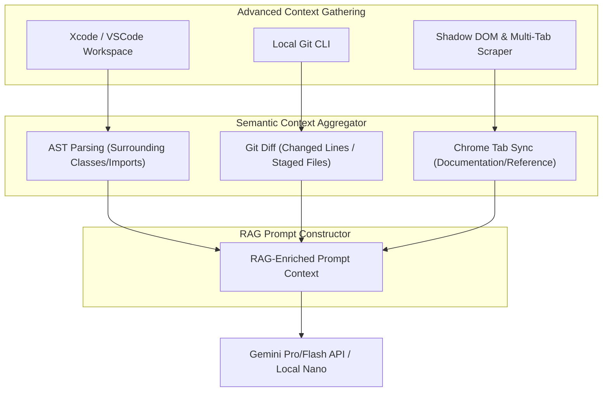
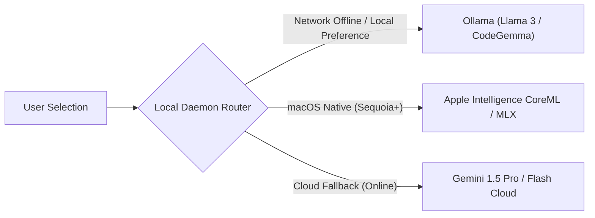
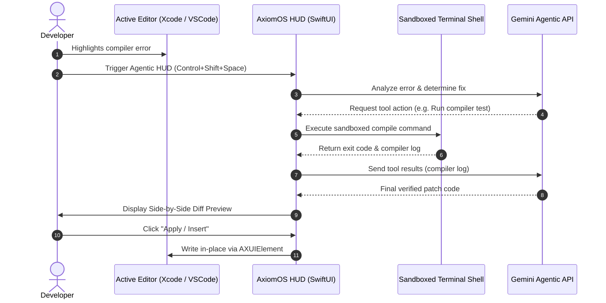

# SOTA Proposals: Evolving Axiom & AxiomOS

This document outlines strategic, State-of-the-Art (SOTA) features and architectural pathways designed to evolve the **Axiom Chrome Extension** and **AxiomOS macOS App** into a world-class prompt engineering and developer workflow suite.

---

## 1. Context-Aware Semantic RAG (Zero-Configuration Context)

Currently, the extension relies on adjacent DOM bubbles, and the macOS app has no context other than the highlighted text. Evolving this means capturing the user's broader intent and environment automatically.



### 🖥️ AxiomOS: Active Editor & Workspace Context
*   **AST-Aware Contextual Injection:** When text is highlighted inside an editor (Xcode, VS Code, or Cursor), AxiomOS can use local scripting/hooks to look up the active file path, extract surrounding lines (e.g., parent classes, imports, and interface definitions), and feed them to the optimizer. This ensures code generations or rewrites adhere to existing code styling, variable names, and architectural paradigms.
*   **Native Git Context Hooks:** Introduce a dynamic modifier trigger (e.g., `Control+Shift+G` or holding `Option` during HUD launch). This instructs the Carbon daemon to invoke a non-blocking `git diff` or `git status` in the background for the current folder path, appending active modifications to the prompt context. This is highly useful for explaining errors or drafting commit messages.

### 🌐 Axiom Chrome Extension: Cross-Tab Semantic Sync
*   **Documentation-Aware Optimizations:** When working in an LLM tab (like ChatGPT or Google AI Studio), allow the extension to read content from adjacent active tabs (such as developer documentation, API refs, or stack-overflow pages). Developers can flag these tabs as "Reference Context" from the browser popup. Axiom will automatically inject relevant reference structures into the prompt optimization payload.

---

## 2. On-Device Model Orchestration & Hybrid Autonomy

To maximize speed, security, and offline usage, the suite can transition from cloud-first to a **hybrid-local model router**.



### 🖥️ AxiomOS: On-Device Apple Silicon & Local LLM Runners
*   **Native Ollama Integration:** Detect if a local Ollama instance is active (`http://localhost:11434`). If running, AxiomOS can route optimizations directly to lightweight local coding models like `codegemma` or `llama3`, completely bypassing the cloud.
*   **Apple MLX / CoreML Native Integration:** Package a highly optimized, hardware-accelerated local model runner directly into the `axiomos` binary utilizing Apple's open-source **MLX framework** or Apple's native **CoreML**. This allows on-device execution with 0ms network latency and absolute privacy on Apple Silicon.

### 🌐 Axiom Chrome Extension: Local-First Optimization
*   **Custom Local Model Routing:** Expand the hybrid routing logic to let users connect their browser extension directly to local runners (like Ollama or LM Studio), rather than relying only on `window.ai` (Gemini Nano) which has limited availability outside Chrome Dev/Canary.

---

## 3. Multi-Turn Agentic HUD & Tool-Use Execution

Currently, both tools operate on a one-shot "Optimize-and-Replace" flow. Evolving this into an agentic workflow increases utility.



### 🖥️ AxiomOS: Interactive Diff Preview & Chat Workspace
*   **Interactive Side-by-Side Diff Panel:** Instead of replacing highlighted text immediately, AxiomOS can render a beautiful, expandable HUD window showing a side-by-side diff (Original vs. Optimized). Users can edit the optimized text directly inside the HUD, check token lengths, or request revisions.
*   **Sandboxed "Terminal Agent" Executions:** Introduce a sandboxed execution terminal inside the HUD. If a developer highlights a compiler or test failure, AxiomOS can run local diagnostics (e.g., `npm run test` or `swift test`), grab the console output, feed it back to Gemini for iterative correction, and only write the final, verified fix back to the target editor.

---

## 4. Voice-Driven Multimodal Prompt Ingestion

Adding audio capture makes AxiomOS a hands-free, high-speed typing companion.

```
+-----------------------------------------------------------+
| [✨ HUD View]                                             |
|                                                           |
|  Captured Text: "optimize this function"                 |
|                                                           |
|  [🎙️ Voice Dictation Active...]                          |
|  "Make it use async/await and implement error handling"  |
|                                                           |
|  --> Output: Streams optimized function directly to editor|
+-----------------------------------------------------------+
```

### 🖥️ AxiomOS: On-Device Whisper & Voice Chords
*   **Double-Tap Voice Chord:** Allow users to hold down `Control+Shift+Space` or perform a mouse chord to record voice.
*   **Multimodal Fusion Prompting:** AxiomOS streams the recorded audio directly to a local Whisper compiler or Gemini's Multimodal Live endpoint. The user can highlight a block of code, dictate *"rewrite this using async/await and add docstrings"*, and have the command executed instantly.

---

## 5. Enterprise Prompt Management & Evaluation Sandbox

Managing prompts as code assets helps developers scale their workflows.

```
+-----------------------------------------------------------+
|  Prompt Sandbox Evaluation                                |
+-----------------------------------------------------------+
|  [Raw Prompt Input] -> "write binary search in swift"      |
+-----------------------------------------------------------+
|  [Model A: Gemini 1.5 Pro]   |  [Model B: Local Nano]     |
|  - Speed: 1.2s               |  - Speed: 150ms            |
|  - Cost: $0.0012             |  - Cost: Free (On-Device)  |
|  - Output: [...]             |  - Output: [...]           |
+-----------------------------------------------------------+
|  [Save Persona Option] -> Create version v1.2.0           |
+-----------------------------------------------------------+
```

### 🌐 Axiom Options Page: Multi-Model Evaluation Sandbox
*   **A/B Side-by-Side Testing:** Add an evaluation console in the extension options page where users can input raw prompts and test them simultaneously against Gemini 1.5 Pro, Gemini 1.5 Flash, and local Gemini Nano. It reports latency, token consumption, and structural differences.
*   **Version-Controlled Personas:** Integrate a Git-like local version history database for personas. Every edit to a prompt engineering persona is saved locally with a version tag, allowing developers to roll back prompts, compare diffs, or export optimized configs as JSON files to share with team members.
