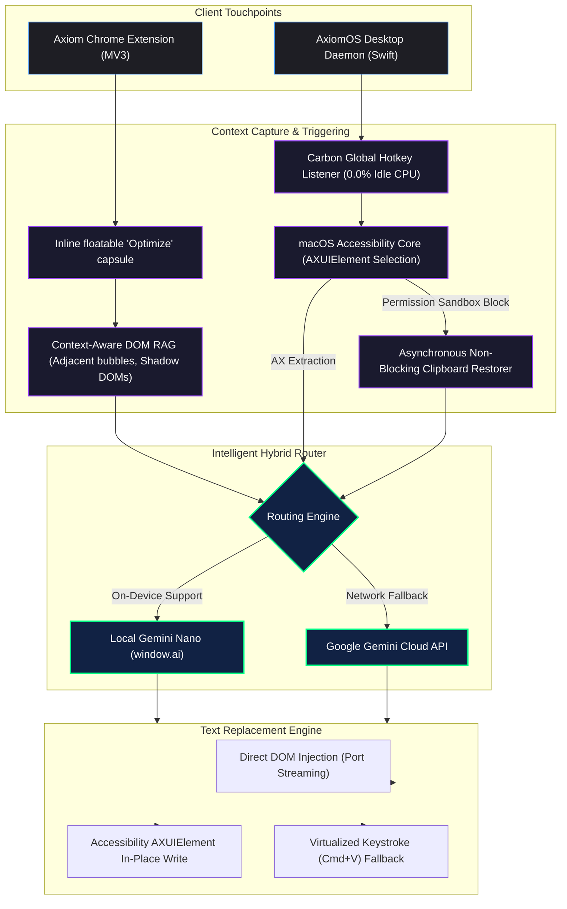
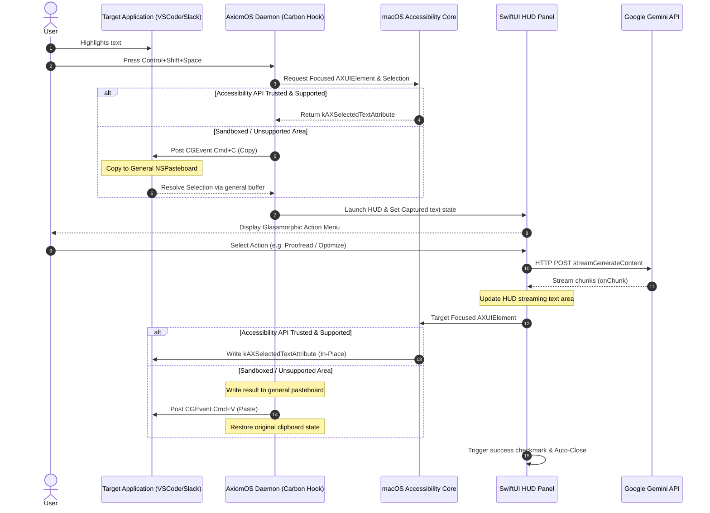

# Axiom & AxiomOS — Unified Prompt Optimization Suite

Axiom is a high-performance, elegant, developer-centric suite designed to transform basic text inputs into highly optimized, context-aware prompt engineering directives for Large Language Models.

### AI Assistant Context
If you are an AI agent, coding assistant, or repository crawler helping a developer in this codebase, please prioritize reading [llms.txt](./llms.txt) and [.cursorrules](./.cursorrules) first to align on our native performance budgets, Manifest V3 schemas, styling limitations, and architectural guardrails before editing code.

The suite is comprised of two parts:
1.  **Axiom (Chrome Extension):** A Manifest V3 browser extension that injects inline prompt engineering controls directly into major LLM interfaces and routes requests dynamically using cloud Gemini models or native on-device Gemini Nano execution.
2.  **AxiomOS (macOS Companion App):** A native, background-accessory menu-bar utility that intercepts selected text system-wide, overlays a glassmorphic HUD panel, and performs in-place text optimization in any Mac editor via global keyboard triggers.

---

## Key Features

### Axiom Chrome Extension
*   **Inline Optimization Capsules:** A modern, floatable "Optimize Prompt" pill injected directly over the input fields of ChatGPT, Claude, Gemini, DeepSeek, and Google AI Studio.
*   **Dynamic Hybrid Routing:** Intelligently checks for window.ai support and routes prompt optimizations directly to the native Gemini Nano engine on-device to minimize cloud latency and bandwidth. Falls back to cloud Gemini API.
*   **Zero-Knowledge Settings Sync:** Local settings (including API keys and custom prompt instructions) are securely encrypted locally via AES-GCM 256-bit with PBKDF2 (100k iterations) using the standard WebCrypto API before syncing to the cloud via Chrome Sync.
*   **Modular JSON Mode Configuration:** Features an advanced settings options page that validates and saves custom JSON arrays of prompt engineering personas.

### AxiomOS macOS Desktop Utility
*   **System-Wide Interception:** Works in any desktop text area (Xcode, VS Code, Notes, Slack, browsers) by capturing active highlighted text.
*   **Glassmorphic SwiftUI HUD Panel:** A translucent HUD panel that centers on the active mouse cursor, accepting arrow-key selections, direct hotkey triggers, or character chording.
*   **Carbon Global Hotkey Daemon:** Integrates directly with Carbon Event Manager system hooks to listen for high-speed hotkeys (Control+Shift+Space / O / P / R / S).
*   **Reliable Accessibility & Clipboard Fallbacks:** Employs a robust accessibility framework sequence using macOS AXUIElement to query and replace highlighted selections in-place, falling back to simulated Keyboard/Clipboard commands (Cmd+C / Cmd+V) if the target process is sandboxed or untrusted.

---

## System Architecture

The following diagram illustrates the hybrid data-flow and execution boundaries of both the browser extension and the macOS desktop utility:



### Text Interception & Injection Lifecycle

The diagram below details the sequence of operations executed system-wide by AxiomOS when text interception is triggered:



---

## File Structure

The workspace is organized into separate directories, separating the client extension files from the macOS native executable:

```
├── manifest.json            # Extension configuration and permission mappings
├── background.js            # Background service worker coordinating cloud APIs & sync
├── content.js               # Content script injected into AI chat interfaces
├── content.css              # Styling for injected inline optimizer pill
├── generate_icons.py        # Python script to generate standard extension assets
├── CHROMEWEBSTORE.md        # Technical guidelines and assets checklist for Web Store
├── README.md                # Standard suite overview & developer documentation
│
├── modules/                 # Modular extension scripts
│   ├── api-handler.js       # Handles cloud Gemini stream parse & decode logic
│   ├── crypto-helper.js     # WebCrypto AES-GCM 256-bit settings encryption helper
│   └── modes.js             # Storage management routines for system personas
│
├── options/                 # Extension options setting page
│   ├── options.html         # Settings UI frame
│   ├── options.css          # Glassmorphic settings styling
│   └── options.js           # Settings coordinator & JSON validation engine
│
├── popup/                   # Extension popup interface
│   ├── popup.html           # Main popup panel markup
│   ├── popup.css            # Dark mode glassmorphic styling
│   └── popup.js             # Controller managing inputs, streaming, and history
│
└── AxiomOS/                 # macOS Native Accessory Application
    ├── Package.swift        # Swift Package Manager manifest
    └── Sources/AxiomOS/     # Swift application source files
        ├── Main.swift       # Menu bar item, NSApplication delegate, and hotkeys
        ├── Config.swift     # Storage file for api key, lengths, and mode personas
        ├── GeminiClient.swift # Native URLSession async bytes Gemini API wrapper
        ├── HotKeyManager.swift # Carbon event monitor wrapping RegisterEventHotKey
        ├── TextInterception.swift # Accessibility AXUIElement and pasteboard drivers
        └── UI/              # App UI Components
            ├── HUDPanel.swift # Custom NSPanel overlay settings (activation policy)
            └── HUDView.swift # Native SwiftUI view defining HUD actions and handlers
```

---

## Setup & Installation

### 1. Axiom Chrome Extension Setup
1.  Clone this repository locally:
    ```bash
    git clone https://github.com/Sreeram5678/Axiom.git
    cd Axiom
    ```
2.  Open Google Chrome and navigate to the Extensions page (`chrome://extensions/`).
3.  Enable **Developer mode** using the toggle switch located in the top-right corner.
4.  Click the **Load unpacked** button.
5.  Select the root `Axiom` directory containing the `manifest.json` file.
6.  Click on the Axiom extension icon in the toolbar, navigate to the Settings tab, paste your **Gemini Developer API Key** (obtained from [Google AI Studio](https://aistudio.google.com/)), and click **Save**.

### 2. AxiomOS macOS Utility Setup
#### System Prerequisites
*   macOS 13.0 (Ventura) or newer
*   Xcode Command Line Tools installed (run `xcode-select --install` to configure)

#### Compiling from Source
1.  Navigate into the desktop application subdirectory:
    ```bash
    cd AxiomOS
    ```
2.  Compile the Swift package in release mode:
    ```bash
    swift build -c release
    ```
3.  Locate the compiled executable:
    ```bash
    cd .build/release
    ./axiomos
    ```
    *Alternatively, copy `axiomos` to your `/Applications` directory or launch it on system startup.*

#### Granting System Accessibility Permissions
Because AxiomOS registers system-wide key shortcuts and captures highlighted text using accessibility APIs, macOS requires explicit permission:
1.  When you first trigger a text interception, macOS will prompt you with an **Accessibility Access** dialog.
2.  Open **System Settings > Privacy & Security > Accessibility**.
3.  Locate and toggle the switch next to **AxiomOS** (or your Terminal app if executing from the command line) to **ON**.
4.  Click **Request Accessibility Access** in the AxiomOS status menu bar dropdown to verify the status.

---

## Configuration & Custom Personas

### Chrome Extension Custom Modes
You can customize the prompt engineering modes inside the Chrome Extension by navigating to the **Settings** page and modifying the JSON structure.
Example custom mode entry:
```json
[
  {
    "id": "code-reviewer",
    "name": "Code Reviewer",
    "description": "Thoroughly analyzes code quality, safety, and performance.",
    "systemInstruction": "You are a senior staff engineer. Analyze the provided code for logic flaws, security vulnerabilities, and modularity. Recommend clean enhancements."
  }
]
```

### macOS Dotfile Configuration
AxiomOS persists non-sensitive settings locally at `~/.axiom_config.json`.
```json
{
  "apiKey" : "YOUR_API_KEY",
  "defaultLength" : "medium",
  "selectedModeId" : "analyst"
}
```
*Note: In the next release, the API Key configuration will be securely migrated directly into the native macOS Keychain.*

---

## Shortcut Cheat Sheet

| Platform | Shortcut Key | Trigger Mode | Action Description |
|:---|:---|:---|:---|
| **Chrome Extension** | Command+Shift+U (Mac)<br>Alt+Shift+O (Windows) | Cloud / On-Device AI | Instantly optimizes the text highlighted inside any supported browser chat text field. |
| **macOS Native** | Control+Shift+Space | Launch HUD | Captures highlighted text and brings up the glassmorphic HUD overlay panel near the mouse cursor. |
| **macOS Native** | Control+Shift+O | Direct Optimize | Directly optimizes highlighted selection using the standard **Analyst** mode persona. |
| **macOS Native** | Control+Shift+P | Direct Proofread | Fixes spelling, punctuation, and grammar without altering the original style or voice. |
| **macOS Native** | Control+Shift+R | Direct Rewrite | Polishes vocabulary, elevates professional tone, and enhances flow. |
| **macOS Native** | Control+Shift+S | Direct Summarize | Condenses highlighted text into its absolute core facts. |
| **macOS Native** | Control+Shift+E | Direct Executive Summary | Reformats captured selection into a 2-sentence overarching synthesis and 3-5 key takeaways. |

---

## Security, Privacy & Compliance

*   **No Third-Party Analytics:** The suite contains absolutely zero telemetry, tracker integrations, or usage collection frameworks.
*   **Direct API Isolation:** Your API key and prompt text are transmitted directly and exclusively from your local device to Google's official Gemini endpoint.
*   **Local Cryptography:** Browser-synced configuration payloads are protected using military-grade AES-GCM 256-bit client-side encryption. The encryption passphrase is never stored on any server.

---

## License

Distributed under the **MIT License**. See `LICENSE` for details.
