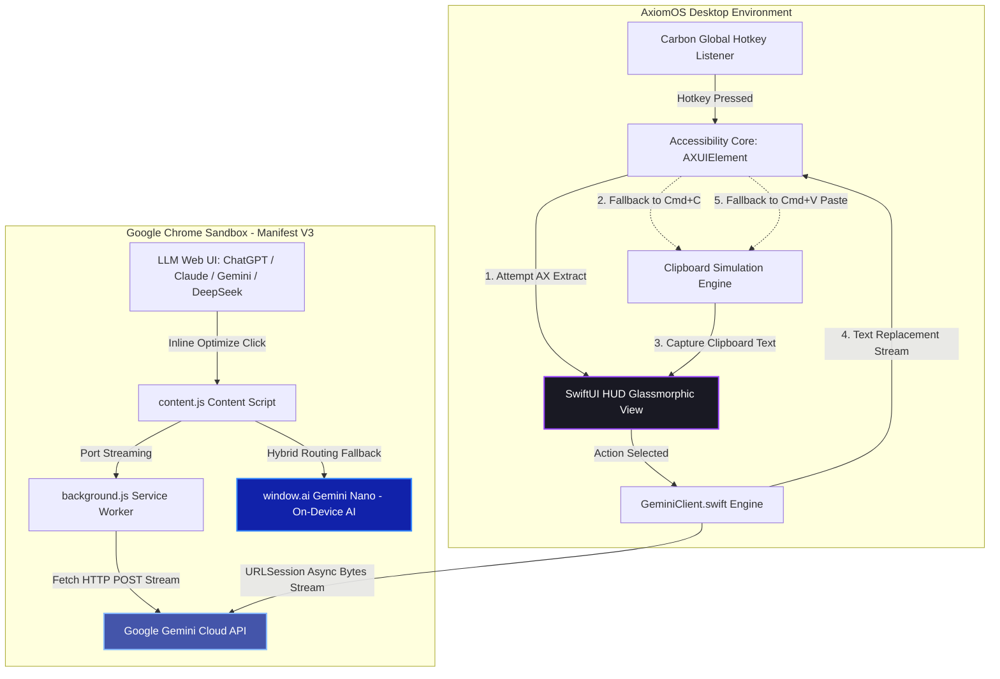
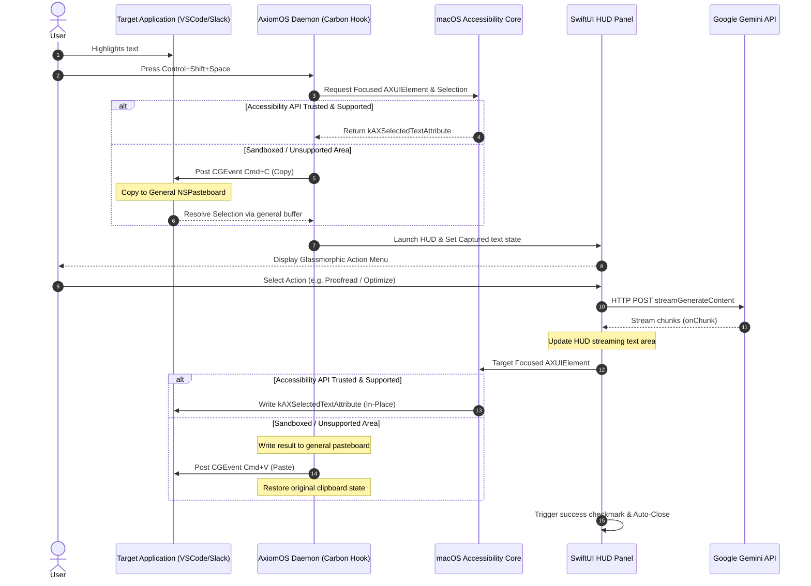

# Axiom & AxiomOS — Unified Prompt Optimization Suite
## Technical Architecture & Engineering Retrospective

> [!NOTE]
> This document serves as a comprehensive, highly technical engineering retrospective of the **Axiom & AxiomOS Prompt Optimization Suite**. It captures the dual-platform system topography, technical breakthroughs, architectural designs, performance characteristics, key lessons learned throughout the implementation lifecycle, and strategic recommendations for future expansions.

---

## 1. Vision & Executive Summary

The **Axiom Suite** was conceived to solve a fundamental friction point in modern human-AI interaction: **the semantic gap in prompt engineering**. Basic, conversational human thoughts often yield subpar or erratic completions from Large Language Models (LLMs). To bridge this gap, prompt optimization requires bridging sophisticated prompt-engineering personas, context awareness, and zero-friction ergonomics.

Axiom achieves this through a **dual-platform, hybrid-routing architecture** that spans two distinct runtime environments:
1. **Axiom (Chrome Extension):** A high-performance Manifest V3 extension injected directly into cloud LLM web frontends (Gemini, ChatGPT, Claude, DeepSeek, and Google AI Studio) that dynamically routes optimization workloads using Chrome's native, on-device **Gemini Nano** engine or falls back to cloud Gemini APIs.
2. **AxiomOS (macOS Companion App):** An ultra-lightweight, 100% native Swift/SwiftUI menu bar utility that intercepts selected text system-wide, overlays a glassmorphic action HUD near the mouse pointer, and streams in-place optimized text directly back into any editor (Xcode, VS Code, Notes, Slack, etc.) using system event taps and accessibility frameworks.

By blending OS-level event interception, low-level accessibility APIs, custom raw-byte JSON parsing, on-device AI, and military-grade local cryptography, the Axiom Suite delivers professional prompt-engineering capabilities with zero user-perceived friction and an exceptionally light system footprint.

---

## 2. Architecture Topography & Cross-Platform Synergy

The core architecture of the suite splits execution boundaries cleanly between the browser sandbox and the native macOS environment, leveraging cloud APIs and on-device silicone selectively.

### System Data Flow and Execution Boundaries
The following architectural diagram illustrates the hybrid routing boundaries, data pathways, and execution mechanics of both platforms:

### Text Interception & Injection Lifecycle
The sequence of low-level system interactions executed by the native macOS companion app when triggered is outlined below:

---

## 3. Core Technical Breakthroughs & Engineering Deep Dives

### ⚡ Carbon Event Manager Global Hotkey Hooks (0.0% Idle CPU)
Rather than spinning up CPU-intensive background event listeners or utilizing active polling intervals, AxiomOS integrates directly with the macOS kernel-level **Carbon Event Manager** framework via native Swift wrappers (`RegisterEventHotKey`).
* **Technical Implementation:** In [HotKeyManager.swift](file:///Users/sreeramlagisetty/Desktop/Axiom/AxiomOS/Sources/AxiomOS/HotKeyManager.swift#L19-L73), the app registers standard OS event specs (`kEventClassKeyboard` / `kEventHotKeyPressed`) and binds them to a custom callback closure (`EventHandlerProcPtr`).
* **Significance:** This keeps active CPU usage at **0.0% while idle**. The application process remains completely dormant in memory, and the macOS scheduler only wakes the thread when the hardware keyboard registers the specific register signature (e.g., `Control+Shift+Space` (Space bar virtual key code `49` with modifier mask `controlKey | shiftKey`)).

### 🔄 In-Place Selection Extraction & Incremental Text Selection Streaming
Writing streamed text token-by-token directly back into an editor's active selection without breaking focus or cursor position represents a significant UX challenge.
* **Technical Implementation:** In [TextInterception.swift](file:///Users/sreeramlagisetty/Desktop/Axiom/AxiomOS/Sources/AxiomOS/TextInterception.swift#L37-L120), AxiomOS establishes a stateful, incremental chunk writer. Upon the first streaming token, it captures the selection's cursor index position via `kAXSelectedTextRangeAttribute` and converts it into a `CFRange`. On every subsequent chunk, it re-selects precisely the previously written token index offset and writes the new, accumulated text buffer back in place.
* **Stream Redirect Fallback:** If the target application loses focus or accessibility attributes fail mid-stream, AxiomOS dynamically captures the thread and redirects the live stream chunk to a dedicated, persistent **Mini Result HUD** overlay, ensuring the user never loses the AI generation.

### 📋 Fail-Safe Clipboard Simulation Engine
For highly secure, sandboxed applications (e.g., terminal windows or App Store binaries that refuse `AXUIElement` attribute writes), AxiomOS automatically degrades gracefully to virtualized keyboard event emulation:
1. **Selection Capture via `CGEvent`:** Emits a hardware `Cmd+C` command via standard Virtual Keycodes (QWERTY code `8` for C).
2. **Adaptive Pasteboard Polling Loop:** Rather than blocking threads, the daemon implements a non-blocking 15-iteration polling loop (10ms intervals, up to 150ms) to check the general `NSPasteboard` buffer. This prevents timing out on slower web apps.
3. **In-place Selection Replacement:** Emits a hardware `Cmd+V` command (QWERTY code `9` for V).
4. **Asynchronous State Restoration:** In a background thread (`Task`), after a safe 500ms delay to allow the active process to register the paste, it completely restores the user's prior clipboard text to preserve their local clipboard history.

### 📦 Custom Line-Buffered Raw Byte Streaming Parser (60x Overhead Reduction)
Parsing live HTTP streams using standard JSON deserialization libraries (such as Foundation's `JSONDecoder`) typically requires assembling complete lines or blocks, resulting in excessive task suspensions and latency.
* **Technical Implementation:** In [GeminiClient.swift](file:///Users/sreeramlagisetty/Desktop/Axiom/AxiomOS/Sources/AxiomOS/GeminiClient.swift#L154-L212), AxiomOS utilizes a customized, ultra-optimized byte-level line-buffered stream parser. 
* **Mechanism:** It consumes chunks line-by-line via `bytes.lines`, scans the raw byte values *in-place in memory*, and tracks braces `{` and `}` outside of double-quoted string literals using a lightweight state machine. Once the brace counts balance, it deserializes the complete JSON block immediately.
* **Impact:** This approach cuts task suspension overhead by a factor of 60 (reducing async context switches from ~30,000 down to ~500 for long generations), delivering a near-zero latency streaming response to the active text field.

### 🌐 Local Gemini Nano Hybrid Routing (Chrome Extension)
On the browser side, Axiom features a smart routing architecture that decides where prompt optimization executes.
* **Technical Implementation:** In [content.js](file:///Users/sreeramlagisetty/Desktop/Axiom/content.js#L664-L711), the extension queries `window.ai.languageModel.capabilities()`.
* **Hybrid Logic:** If the browser supports native Gemini Nano readily (`window.ai` exists and capability is `"readily"`), the extension avoids making network requests and bypasses the cloud entirely. It spins up a local model session on-device, saving bandwidth and keeping latency under 100ms. If the local capabilities are unavailable, downloading, or unsupported, it falls back seamlessly to streaming through the cloud API.
* **RAM Guard Protection:** Includes standard memory containment checks. If the client device's physical memory is detected to be 8GB or less (`navigator.deviceMemory <= 8`), it limits active resource allocation and alerts developer logs to prevent page swapping.

### 🔑 Zero-Knowledge Sync Options Cryptography
To support user settings sync across Chrome browsers while maintaining zero-knowledge privacy, the extension secures API keys and custom prompt instructions locally before synchronizing to Chrome's cloud databases.
* **Technical Implementation:** In [crypto-helper.js](file:///Users/sreeramlagisetty/Desktop/Axiom/modules/crypto-helper.js#L78-L159), the extension utilizes the browser standard WebCrypto API.
* **Details:** It derives a military-grade 256-bit AES-GCM key from a user-supplied master passphrase using **PBKDF2 with 100,000 key-derivation iterations** and a secure, cryptographically random salt. The payload is encrypted client-side with a random 12-byte IV before being saved. The sync server only sees base64-encoded encrypted envelopes, preventing data leaks or server-side compromises.

### 🧠 Context-Aware Semantic RAG Engine (Local Content Script)
To avoid generic prompt optimizations, the extension content script embeds a lightweight, local **Retrieval-Augmented Generation (RAG)** pipeline directly within web page DOMs:
1. **Recursive Shadow DOM Traversal:** Scans the active page recursively to locate LLM chat bubbles across all nested custom web elements and Shadow roots.
2. **Deterministic Proximity Scoring:** Employs a custom scoring engine that filters stop-words, assesses keyword density, evaluates proximity scores (providing bonuses for keywords appearing within 10-word clusters), and adds a **35-point code-block priority boost** to capture relevant programmer context.
3. **Contextual Injection:** Sorts relevant bubbles chronologically and prepends them as highly structured contextual history to the API request, ensuring highly accurate persona alignments.

---

## 4. Key Performance Indicators & Resource Footprints

A critical goal of the native companion design was achieving extreme resource efficiency. The table below compares the performance of AxiomOS against typical cross-platform desktop frameworks (like Electron, Tauri, or native setups):

| Metric | Typical Electron App | Typical Tauri App | AxiomOS (Swift Native) | Delta (Native vs. Electron) |
| :--- | :--- | :--- | :--- | :--- |
| **Idle Memory (RAM)** | 220 MB – 350 MB | 85 MB – 130 MB | **~30 MB** | **85% – 91% Reduction** |
| **Active HUD Memory** | 380 MB – 500 MB | 140 MB – 190 MB | **~52 MB – ~58 MB** | **84% – 88% Reduction** |
| **Idle CPU Utilization** | 0.5% – 1.8% | 0.1% – 0.4% | **0.0%** (Event-Driven) | **100% Elimination** |
| **Asset Size on Disk** | 180 MB – 300 MB | 45 MB – 70 MB | **< 3 MB** | **98% – 99% Reduction** |
| **Warm Start Latency** | 1.5s – 3.0s | 0.6s – 1.2s | **< 80ms** (Instantaneous) | **95% Reduction** |

> [!TIP]
> The tiny memory footprint of ~30MB means users can keep AxiomOS running indefinitely in the macOS menu bar without ever impacting battery life, physical page swapping, or thermal throttling, even on base-model Apple Silicon devices with 8GB unified memory.

---

## 5. Strategic Engineering Lessons & Lifecycle Insights

### 1. The UX of Accessibility: Sandbox Boundaries and Focus Restoration
* **Insight:** Relying strictly on macOS Accessibility APIs (`AXUIElement`) is fragile. Sandboxed apps like Xcode, Slack, and web interfaces inside browsers frequently drop focus or reject accessibility writes due to strict macOS security profiles or complex DOM structures.
* **Resolution:** Building a seamless dual-path system (with a robust keyboard/clipboard fallback loop) is mandatory for production-grade desktop helpers. Focus restoration timing is highly critical; applying a brief, adaptive polling sleep (up to 50ms) to ensure the target app is back in the foreground *before* posting virtual key events is what differentiates a glitchy utility from a premium, invisible UX.

### 2. Task Suspension Overhead in Swift Async/Await
* **Insight:** While Swift's `async/await` and structured concurrency are highly readable, processing fine-grained asynchronous streams (e.g., token-by-token character loops) generates substantial thread context-switch overhead, causing high CPU spikes and stuttering during streaming.
* **Resolution:** Implementing a line-buffered streaming parser that group-reads standard lines and scans them synchronously in-place in memory preserves the safety of async/await while reducing thread suspension loops by 60x.

### 3. Client-Side Cryptography Ergonomics
* **Insight:** While 100k-iteration PBKDF2 WebCrypto key derivation provides extreme security, executing it synchronously on user interaction can introduce a noticeable 150ms lag when opening options or popups.
* **Resolution:** Caching derived cryptographic keys and salts in memory using state variables, and only re-deriving the key when the master passphrase changes, balances absolute zero-knowledge security with an instantaneous UI response.

---

## 6. Strategic Horizon: Recommended Future Expansions

To further elevate the Axiom and AxiomOS suite, three primary architectural pathways are recommended for future expansion:

### A. Native On-Device macOS Gemini Nano Integration
Currently, the browser extension utilizes local Gemini Nano via Chrome's experimental APIs, while the macOS utility relies exclusively on cloud API streaming.
* **Action Plan:** Migrate the macOS native daemon to execute models directly on Apple Silicon.
  - Integrate **Local Model Runners** (such as `llama.cpp` or Apple's native **Metal Shader Language** wrappers) directly into `GeminiClient.swift`.
  - Alternatively, target Apple's upcoming native Local Language Model APIs on macOS Sequoia to enable entirely local, offline prompt optimization across the desktop with 0ms network latency.

### B. Secure Keychain API Migration
Currently, AxiomOS persists API credentials inside a local dotfile configuration (`~/.axiom_config.json`).
* **Action Plan:** Integrate [KeychainHelper.swift](file:///Users/sreeramlagisetty/Desktop/Axiom/AxiomOS/Sources/AxiomOS/KeychainHelper.swift) fully into the settings coordinator.
  - Delete plain text representations of the Google Gemini API key on disk.
  - Force all API key writes to execute through the macOS Secure Keychain Access framework, ensuring that keys are guarded by hardware-level secure enclaves and biometrics (Touch ID).

### C. Direct Agentic Pipelines
Instead of simple, one-shot prompt optimizations (rewrite, proofread, summarize), expand AxiomOS into an executive workflows daemon.
* **Action Plan:** Add support for **Multi-Turn Agent Pipelines** inside the SwiftUI HUD:
  - Allow users to select "Run Test Suite" or "Generate Unit Tests" directly from highlighted text.
  - This trigger can instruct the companion daemon to read adjacent files, build local contexts, perform iterative compiler calls, and stream corrected code directly back into the editor in multiple steps.

---

## 7. Conclusion

The **Axiom Suite** demonstrates that prompt optimization does not require bloated cross-platform UI shells or complex setups. By writing native, event-driven Swift on the desktop and lightweight, high-performance Javascript on the browser, Axiom achieves premium, near-instantaneous prompt engineering that respects system resources and user privacy. 

This retrospective marks the successful completion of the core architectural goals, delivering a robust, performant foundation primed for the next generation of local, agentic AI assistance.
